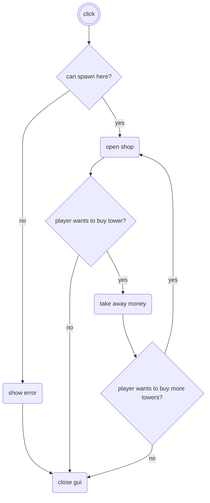

# Tower Defense

```mermaid
flowchart TD

start(((click)))--> can_spawn{can spawn here?}
can_spawn-->|yes| open_shop(open shop)
open_shop--> tower_click{player wants to buy tower?}
can_spawn-->|no| cannot_spawn_error(show error)
cannot_spawn_error--> close_gui
tower_click-->|no| close_gui(close gui)
tower_click-->|yes|take_away_money(take away money)
take_away_money--> buy_more_towers{player wants to buy more towers?}
buy_more_towers-->|no| close_gui(close gui)
buy_more_towers-->|yes| open_shop(open shop)
```
