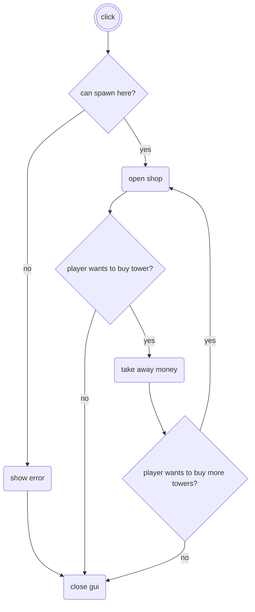

# Tower Defense

### [Download](https://github.com/DutchMTC/Tower-Defense/releases/tag/Release)

## Controls
All you need to play the game is your mouse.
You can click the stone to place towers and you can click on towers to inspect them to upgrade or sell them.

## Mechanics
### Buying towers using coins
You can buy towers using your coin balance. You gain coins by killing enemies.

### Upgrading towers
You can upgrade towers to make them stronger and deal more damage towards enemies.

### Selling towers
You can sell towers and earn back a few coins to place it at another spot or to upgrade another tower.

