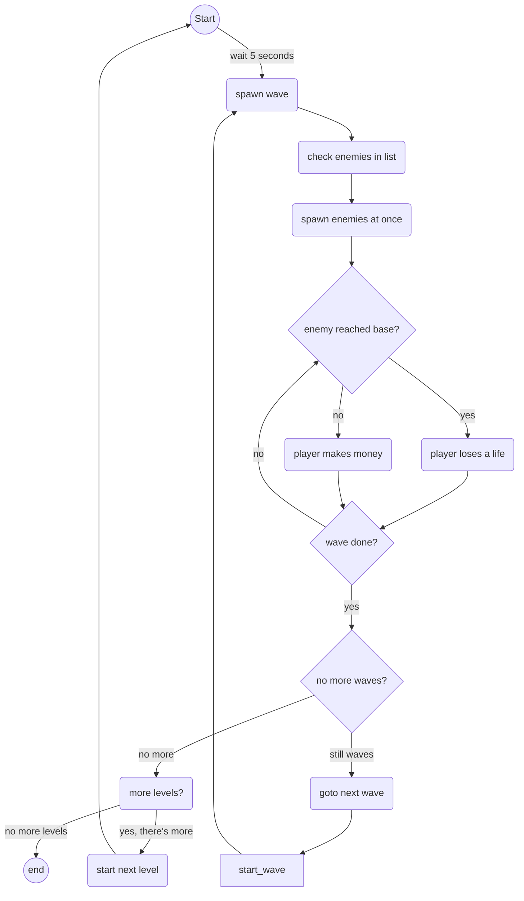

# Tower Defense

```mermaid
flowchart TD

start((Start)) -->|wait 5 seconds| spawn_w(spawn wave)
spawn_w --> checken(check enemies in list)
checken --> spawn_e(spawn enemies at once)
spawn_e --> reached_base{enemy reached base?}
reached_base -->|yes| lose_life(player loses a life)
reached_base -->|no| money(player makes money)
lose_life --> wave_done{wave done?}
money --> wave_done
wave_done -->|no| reached_base
no_more_waves{no more waves?} -->|no more| more_lev(more levels?)
wave_done -->|yes| no_more_waves
no_more_waves -->|still waves| next_wave(goto next wave)
next_wave --> start_wave
start_wave --> spawn_w
more_lev -->|yes, there's more| next_lev(start next level)
more_lev -->|no more levels| end_d((end))
next_lev --> start
```

```mermaid
flowchart TD

start((Start)) -->| can_spawn(Can Spawn at location)
can_spawn --> |yes| open_shop(Open Shop GUI)
can_spawn --> |no| can_spawn
```
