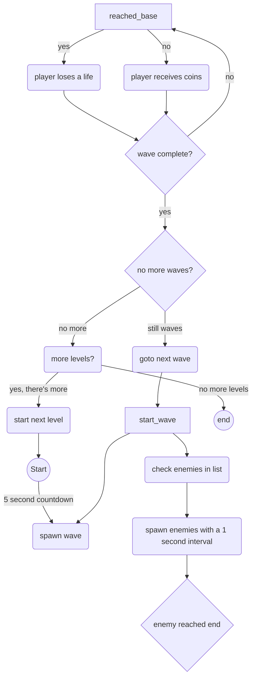

# Tower Defense

```mermaid
flowchart TD

start((Start)) -->|5 second countdown| spawn_w(spawn wave)
start_wave --> check_enemies(check enemies in list)
check_enemies --> spawn_enemies(spawn enemies with a 1 second interval)
spawn_enemies --> reached_end{enemy reached end}
reached_base -->|yes| lose_life(player loses a life)
reached_base -->|no| money(player receives coins)
lose_life --> wave_complete{wave complete?}
money --> wave_complete
wave_complete -->|no| reached_base
no_more_waves{no more waves?} -->|no more| more_lev(more levels?)
wave_complete -->|yes| no_more_waves
no_more_waves -->|still waves| next_wave(goto next wave)
next_wave --> start_wave
start_wave --> spawn_w
more_lev -->|yes, there's more| next_lev(start next level)
more_lev -->|no more levels| end_d((end))
next_lev --> start
```
